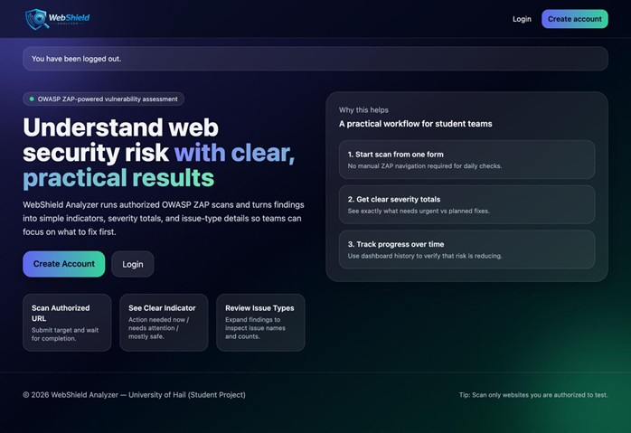
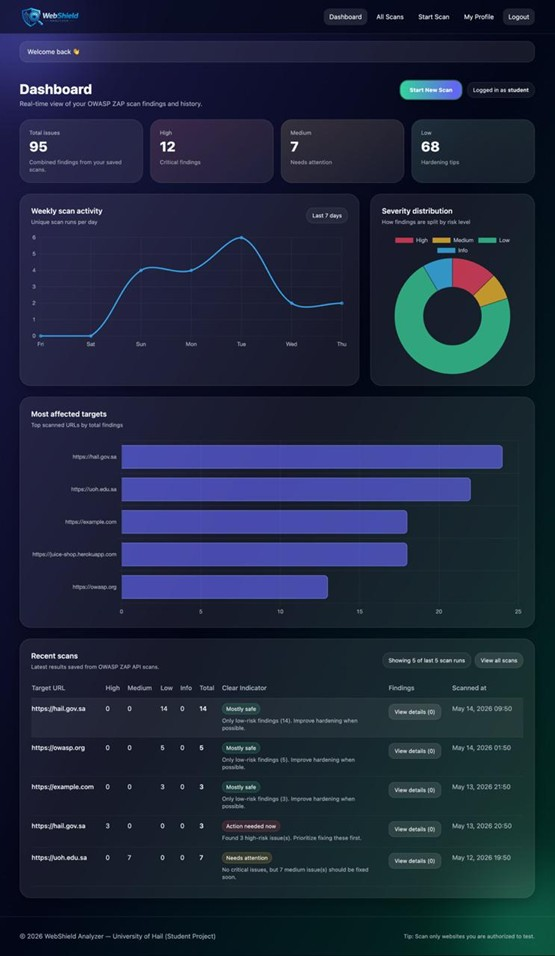
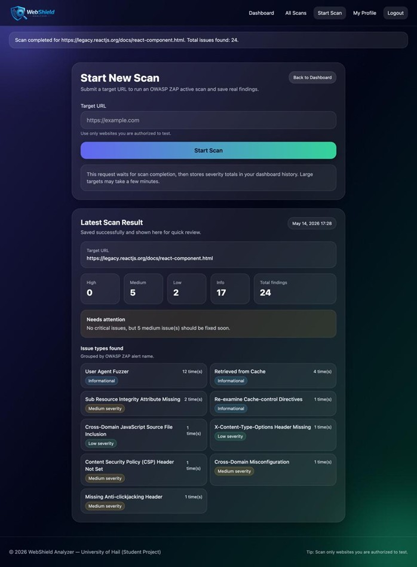
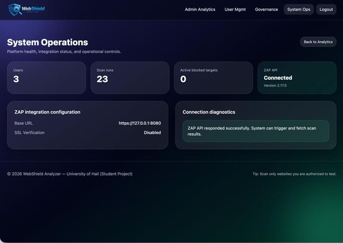
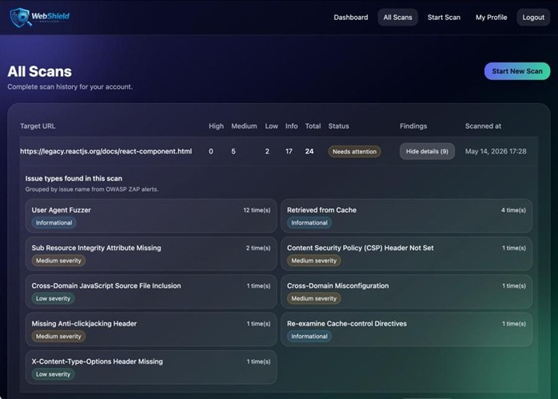

# 🛡️ WebShield Analyzer

A web-based vulnerability assessment platform developed as a graduation project at the University of Hail.

WebShield Analyzer integrates with **OWASP ZAP** to automate web application security scanning, visualize security findings, and help users identify and understand vulnerabilities through an interactive dashboard.

---

## ✨ Features

- 🔐 User Authentication & Authorization
- 🌐 Web Application Vulnerability Scanning
- ⚡ OWASP ZAP Integration
- 📊 Security Dashboard
- 📈 Scan History & Analytics
- 🎯 Severity Classification (High, Medium, Low, Info)
- 👤 User Profile Management
- 🛠️ System Operations Dashboard
- 📋 Detailed Vulnerability Reports

---

## 🖼️ Screenshots

### Landing Page



### Dashboard



### Start Scan



### Scan Results



### System Operations



---

## 🛠️ Technologies Used

- Python
- Django
- SQLite
- HTML
- CSS
- JavaScript
- OWASP ZAP
- Chart.js

---

## 🚀 Installation

```bash
git clone https://github.com/shjoonfahad/WebShield-Analyzer.git

cd WebShield-Analyzer

pip install -r requirements.txt

python manage.py migrate

python manage.py runserver
```

---

## 🎯 Project Objectives

- Automate web vulnerability assessment.
- Integrate OWASP ZAP into a web application.
- Provide an easy-to-use interface for vulnerability scanning.
- Help users understand and prioritize security findings.

---

## 🔮 Future Improvements

- PDF Report Generation
- Email Notifications
- Scan Scheduling
- Multi-user Collaboration
- Enhanced Analytics
- Additional Security Integrations

---

## 👩‍💻 Author

**Shujun Alsaif**

Information Security Graduate

University of Hail

- 💼 LinkedIn: https://www.linkedin.com/in/shujun-alsaif
- 💻 GitHub: https://github.com/shjoonfahad
